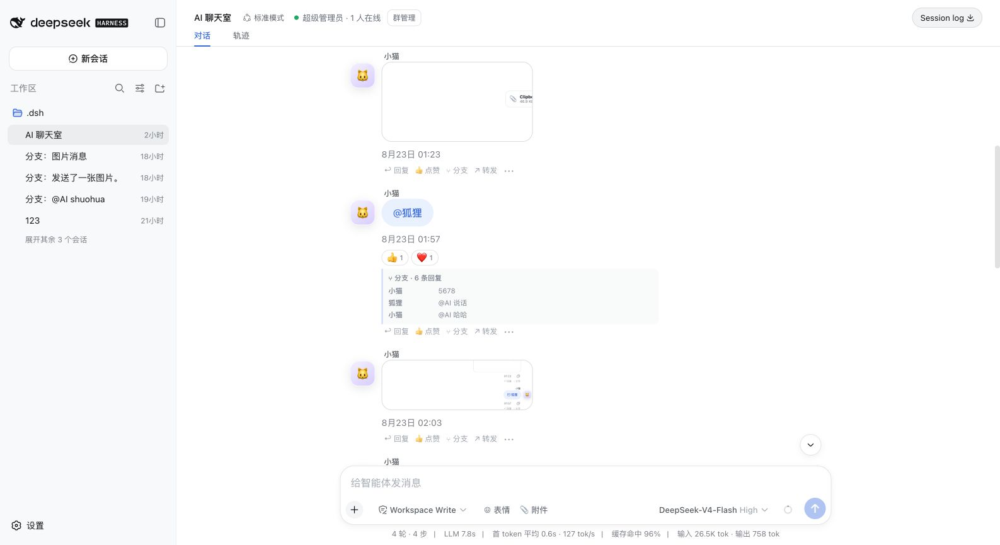
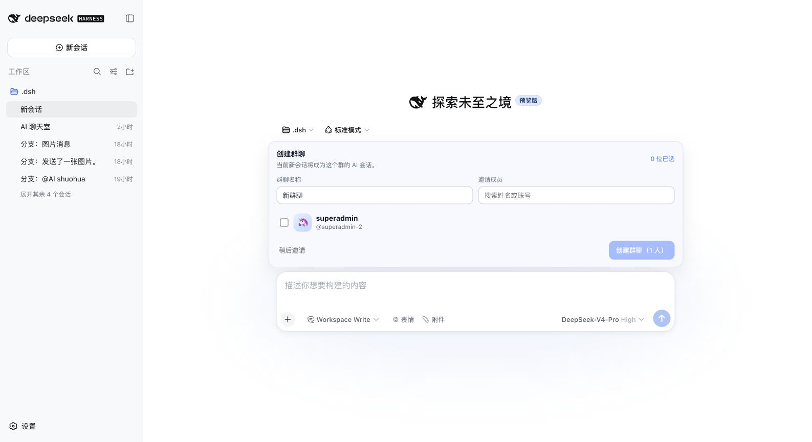
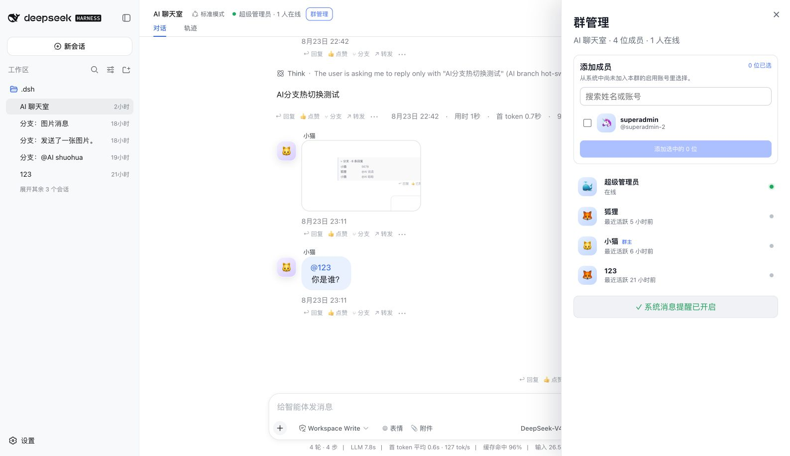
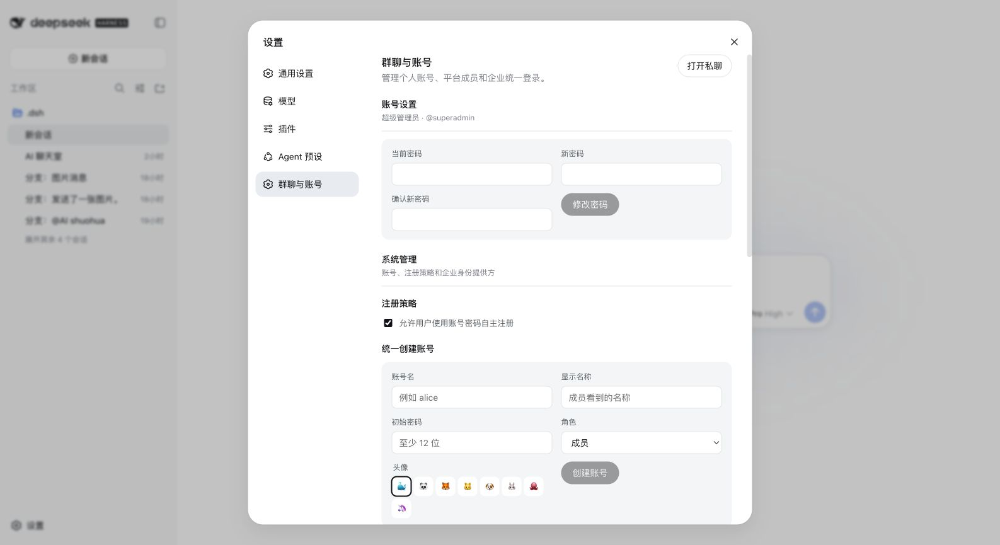

<div align="center">
  <h1>DeepSeek Harness Chatroom</h1>
  <p><strong>A multi-user collaboration layer for the native DeepSeek Harness Web UI.</strong></p>
  <p><a href="README.zh.md">简体中文</a> · English</p>
  <p>
    
    
    
    
  </p>
</div>

Turn every native [DeepSeek Harness](https://github.com/deepseek-ai/deepseek-harness) Session into a persistent shared room—without replacing the sidebar, conversation stream, Agent runtime, model picker, permission controls, trajectory, or Session log.

<p align="center">
  
</p>
<p align="center"><sub>Human-first chat, native Agent responses, rich media, reactions, and live branch previews in one Session.</sub></p>

## Why this plugin

| Native Harness, preserved | Collaboration, added | Identity, ready for deployment |
| --- | --- | --- |
| Sessions, Agent presets, models, permissions, Think/tool trajectory, approvals, questions, slash commands, stop/queue/steer, and retries stay native. | Shared rooms, presence, mentions, replies, reactions, rich media, forwarding, multi-select, branches, notifications, group management, and private chat. | Local accounts, administrator provisioning, roles, account revocation, `dsh-auth`, enterprise OIDC/SSO, automatic provider redirect, and an edge `forward_auth` contract. |

The plugin is out-of-tree and does **not** modify DeepSeek Harness. Its initialization is asynchronous: chatroom storage, model, or Session failures remain isolated and never prevent Harness Web from starting.

## Product tour

<table>
  <tr>
    <td width="50%">
      <br>
      <strong>Create the room before the first message</strong><br>
      Name the room, search the platform user directory, select several members, and keep the native new-Session composer.
    </td>
    <td width="50%">
      <br>
      <strong>Manage members in place</strong><br>
      Owners, room administrators, and platform super administrators add known accounts directly and see roles and presence.
    </td>
  </tr>
  <tr>
    <td colspan="2">
      <br>
      <strong>Keep administration inside Harness Settings</strong><br>
      Registration policy, account creation, roles, password rotation, private chat, `dsh-auth`, and OIDC providers follow the native Settings design language.
    </td>
  </tr>
</table>

> Screenshots are captured from the deployed v1.1.5 product UI. No mockups are used.

## Core capabilities

### Shared rooms and human-first AI

- Every ordinary Harness Session becomes a durable room on first use; **New session** always creates a distinct room.
- Human messages synchronize in real time without waking the Agent. `@AI` or the configured AI display name explicitly requests an Agent reply.
- The native `@` menu lists the Agent and current room members together. Participant identity is attached on the Host before Session admission, so browsers and the model see the same sender.
- The Session header shows the current identity, online count, and **Group management**. New-message toasts, title unread counts, and opt-in browser notifications work across rooms.

### Complete native Agent runtime

- The native sidebar, Conversation/Trajectory tabs, composer, model and permission selectors, reasoning/tool flow, Session log, approvals, questions, slash commands, stop/queue/steer, failures, and retries remain intact.
- Persistent branches open in a right-side panel and own independent Harness Sessions. Branches support Markdown, `@` candidates, images/files, quotes, reactions, forwarding, selection, and the full Agent runtime without nested chatroom branches. Gateways that reject embedded documents switch immediately to an inline compatibility view instead of waiting for a timeout, with the complete Agent available in a new tab.
- Historical images remain durable. For text-only models, only the model request receives deterministic text markers in place of image input; the UI keeps the original media.

### Messaging and media

- Avatars, timestamps, reply quotes, emoji insertion, message reactions, Markdown, image previews, and authenticated file upload/download.
- Pure image and file messages render directly—no extra “sent an image/file” placeholder bubble. Oversized images are resized before entering Harness attachment storage.
- Reply, like, branch, and forward are available from the message row; copy, reaction picker, and multi-select remain available from the overflow/context menu, with a mobile bottom sheet.
- Merged forwarding is rebuilt from authoritative Session events and retains text/Markdown, media, quotes, nested forwards, and reaction counts.

### Accounts, SSO, and private chat

- Optional local password registration, super-administrator account provisioning, roles/status, password rotation, disabled-account revocation, and one identity reused across rooms.
- Pluggable authentication through local accounts, [`dsh-auth`](https://github.com/hxy91819/dsh-auth), or enterprise OIDC Authorization Code with discovery, PKCE, state, and nonce.
- The chosen external provider can automatically receive unauthenticated users; `local=1` keeps a local recovery entry.
- Durable private text conversations are visible only to their two participants and reuse the same unread/toast/browser-notification channel.

<details>
<summary><strong>Recent releases</strong></summary>

- **1.1.8** — replace blocked native branch frames with an immediate messaging fallback, retain direct access to the complete Agent, and collapse Markdown-heavy branch subjects into compact titles.
- **1.1.7** — keep isolated branch runtimes on their target Session instead of navigating back to the parent room during startup.
- **1.1.6** — attach every new or resumed branch Session to the native Workspace so the retained Harness iframe can select it without timing out.
- **1.1.5** — create a group and select platform members directly on the native blank-Session screen.
- **1.1.4** — guarantee distinct native New Sessions and exclude branch Sessions from blank-Session reuse.
- **1.1.3** — replace copied invitation links with direct account-directory selection.
- **1.1.2** — rebuild **Settings → Chatroom & accounts** in the native Harness Settings design language.
- **1.1.0** — make Harness Sessions shared by default, add account/SSO administration, and prefer installed `dsh-auth` as the initial login provider.

</details>

## Requirements

- Node.js 22.19 or later
- pnpm 10.33.4
- DeepSeek Harness 0.1.0-rc.7 or later
- A working default model selection in the Harness Web profile

## Install from GitHub

When upgrading, remove the previous plugin record before installing the current repository:

```sh
pnpm dsh plugin --profile web remove deepseek-harness-chatroom
pnpm dsh plugin --profile web add github:sliverp/DeepSeek-harness-chatroom
pnpm dsh --profile web
```

For a local checkout:

```sh
pnpm dsh plugin --profile web add /absolute/path/to/DeepSeek-harness-chatroom
pnpm dsh --profile web
```

The browser bundle is discovered through the plugin's `dsh.client` manifest. It idempotently binds ordinary Harness Sessions to shared rooms and contributes identity status, group management, input candidates, and file/reply controls. It does not replace the conversation, sidebar, details, or native text composer.

## Configure

Installation adds this row to the Web profile:

```yaml
- id: chatroom
  name: deepseek-harness-chatroom
  config:
    roomId: lobby
    roomTitle: AI Chatroom
    aiDisplayName: DeepSeek
    sessionId: chatroom-v1-lobby
    cwd: !!js process.env.DSH_CHATROOM_CWD ?? process.cwd()
    agentPreset: standard
    settingsAdminParticipantIds: !!js (process.env.DSH_CHATROOM_SETTINGS_ADMIN_IDS ?? '').split(',').map(value => value.trim()).filter(Boolean)
    authEnabled: !!js Boolean(process.env.DSH_CHATROOM_AUTH_SECRET)
    authSecret: !!js process.env.DSH_CHATROOM_AUTH_SECRET ?? ''
    authPublicOrigin: !!js process.env.DSH_CHATROOM_AUTH_PUBLIC_ORIGIN ?? ''
    authBootstrapToken: !!js process.env.DSH_CHATROOM_AUTH_BOOTSTRAP_TOKEN ?? ''
    authAllowSelfRegistration: !!js process.env.DSH_CHATROOM_SELF_REGISTRATION !== 'disabled'
    authDshAuthHeaders: !!js process.env.DSH_CHATROOM_DSH_AUTH_HEADERS === 'enabled'
    authDshAuthVerifyUrl: !!js process.env.DSH_CHATROOM_DSH_AUTH_VERIFY_URL ?? ''
    authDshAuthLoginPath: !!js process.env.DSH_CHATROOM_DSH_AUTH_LOGIN_PATH ?? '/auth/login'
    authMode: !!js process.env.DSH_CHATROOM_AUTH_MODE ?? 'local'
    authDshAuthSuperAdminSubjects: !!js (process.env.DSH_CHATROOM_DSH_AUTH_SUPER_ADMINS ?? '').split(',').map(value => value.trim()).filter(Boolean)
    authDshAuthAvatarUrlTemplate: !!js process.env.DSH_CHATROOM_DSH_AUTH_AVATAR_TEMPLATE ?? ''
    authDshAuthAvatarAllowedOrigins: !!js (process.env.DSH_CHATROOM_DSH_AUTH_AVATAR_ORIGINS ?? '').split(',').map(value => value.trim()).filter(Boolean)
    authDshAuthRevalidateSeconds: !!js Number(process.env.DSH_CHATROOM_DSH_AUTH_REVALIDATE_SECONDS ?? 60)
```

Override it in the Web profile's `cordis.patch.yml` when needed:

```yaml
- id: chatroom
  name: deepseek-harness-chatroom
  config:
    roomId: team-room
    roomTitle: Team AI Room
    aiDisplayName: DeepSeek
    sessionId: chatroom-v1-team-room
    cwd: /absolute/path/available/to-the-room-agent
    agentPreset: standard
    cookieName: dsh_chatroom_session
    cookieMaxAgeSeconds: 31536000
    maxDisplayNameChars: 24
    maxRoomTitleChars: 80
    maxMessageTextChars: 20000
    maxFileBytes: 20971520
    maxFilesPerMessage: 5
    maxMessageFileBytes: 52428800
    maxImageSidePixels: 4096
    settingsAdminParticipantIds:
      - participant-id-of-an-administrator
    maxSettingsRequestBytes: 1048576
    sseHeartbeatMs: 15000
    authEnabled: true
    authCookieName: dsh_chatroom_auth
    authSessionMaxAgeSeconds: 2592000
    authSecret: a-random-secret-containing-at-least-32-utf8-bytes
    authPublicOrigin: https://chat.example.com
    authBootstrapToken: one-time-super-administrator-bootstrap-token
    authAllowSelfRegistration: true
    authDshAuthHeaders: false
    authDshAuthVerifyUrl: ''
    authDshAuthLoginPath: /auth/login
    authMode: local
    authDshAuthSuperAdminSubjects: []
    authDshAuthAvatarUrlTemplate: ''
    authDshAuthAvatarAllowedOrigins: []
    authDshAuthRevalidateSeconds: 60
```

`authSecret` encrypts OIDC client secrets and hashes no passwords directly; keep it stable and outside Git. Local passwords use salted scrypt. The first password registration must present `authBootstrapToken` and becomes the initial super administrator. Later registrations follow the mutable policy in **System administration**. Login attempts are bounded in memory, disabling an account revokes all its sessions, and changing a password rotates the current session and revokes older ones. The authentication cookie is random, stored only by SHA-256 digest, `HttpOnly`, `SameSite=Strict`, root-scoped, and `Secure` whenever `authPublicOrigin` uses HTTPS.

### Enterprise OIDC and dsh-auth

Add OIDC providers from **System administration**. The displayed callback URL must be registered exactly at the identity provider. Discovery and the authorization-code exchange use OIDC discovery, PKCE, state, and nonce; the client secret is stored with AES-256-GCM under `authSecret` and is never projected back to the UI. The first enabled external provider automatically becomes the unauthenticated entry; **Unauthenticated entry** can select a different provider or restore the login chooser. In `hybrid`/`local` modes, add `local=1` to the original application URL to reach the local-account recovery form; bootstrap always remains on the local registration page.

To reuse [`dsh-auth`](https://github.com/hxy91819/dsh-auth), keep its `/auth/*` routes on the same public origin and set `DSH_CHATROOM_DSH_AUTH_VERIFY_URL` to its loopback `/auth/verify` URL (typically `http://127.0.0.1:3080/auth/verify`). Verified dsh-auth accounts are ordinary chatroom members unless their stable subject appears in `authDshAuthSuperAdminSubjects`; the edge `admin` role is not a chatroom role. Production can set `authMode: dsh-auth-only`, disable self-registration, and keep the 60-second upstream revalidation interval. Local password and OIDC entry points are then hidden, and revoked upstream sessions stop working at the next validation; the `local=1` recovery switch is available only in `hybrid`/`local` modes. Avatar URLs are HTTPS-only, optionally generated with `authDshAuthAvatarUrlTemplate` and constrained by `authDshAuthAvatarAllowedOrigins`; failed loads fall back to the built-in avatar. `authDshAuthHeaders` remains a trusted-gateway compatibility switch and is disabled by default.

### Whole-site edge enforcement

Enabling the plugin's account APIs does not by itself make a publicly reachable Harness secure. Keep Harness loopback-only and configure the public TLS proxy to:

1. Return `404` for public requests to `/plugins/deepseek-harness-chatroom/api/auth/verify`.
2. Proxy only the explicit login/register/logout, `/auth/page`, `/auth/providers`, OIDC, and dsh-auth callback routes without authentication.
3. Run every other Harness page, asset, API, plugin, SSE, download, and WebSocket request through an internal `forward_auth` subrequest to that verify URL.
4. Pass the original URI as `X-Original-URI`, convert a `401` plus `X-Dsh-Auth-Login` to a `303` only for top-level page navigation, and preserve `Set-Cookie` returned by verification.
5. Remove inbound `X-Dsh-Auth-User-Id`, `X-Dsh-Auth-Username`, and `X-Dsh-Auth-Roles` before copying verified values.

The verifier returns `204` with verified identity headers, or `401` with the standalone login location. This arrangement keeps the authentication edge independent from Harness startup: the plugin registers immediately, reports `503` until its own storage is ready, and a provider discovery/login failure does not prevent Harness from starting.

`settingsAdminParticipantIds` defaults to an empty list, so remote browsers cannot read or modify Harness configuration. Production deployments may supply the allowlist through the comma-separated `DSH_CHATROOM_SETTINGS_ADMIN_IDS` environment variable. The current identity's `participantId` is available in the authenticated `/plugins/deepseek-harness-chatroom/api/session` response. Changing a display name or avatar preserves that ID; resetting the chatroom identity creates a new ID and requires an allowlist update. A remote Models request must also carry the valid HttpOnly chatroom cookie and pass the same-origin check.

`sessionId` remains the persistent Session for the pre-upgrade lobby. When an authenticated member first opens an ordinary Harness Session, the plugin idempotently creates only the shared-room record for that exact Session ID. Room managers add active platform accounts from the Group management drawer. Every branch still receives an independent persistent Session.

The API route is registered immediately and reports `503` until identity storage and the Session are ready. Initialization runs in the background, and failures remain isolated from Harness Web startup.

## Browser identity and security

When authentication is disabled, the legacy browser identity still receives a random 256-bit token in an API-scoped `HttpOnly`, `SameSite=Strict` cookie. This mode identifies participants but is not an access-control mechanism. When authentication is enabled, the account cookie described above is authoritative for rooms, files, images, settings administration, notifications, and private conversations.

A display name is presentation, not authentication. Remote Models authorization compares the opaque `participantId` resolved by the server from the HttpOnly cookie and never trusts the editable display name. The configuration carrier retains API Proxy schema validation, secret redaction, and revision-conflict checks; credentials are write-only and never returned, while `settings.openDocument`, Sessions, filesystem methods, and every other privileged API are absent from the allowlist. Every participant who can reach the room can still submit input to the configured Agent preset and may use its tools. Use a restricted preset and narrow `cwd` for rooms exposed beyond a trusted team.

## Verify

1. Open Harness Web and finish login or first-time identity setup. No floating **Shared sessions** button should appear.
2. Use the native **New session** action. The Session must automatically become a shared room while retaining the sidebar, Conversation/Trajectory tabs, native composer, and Session log.
3. Open **Settings → Chatroom & accounts** and verify account, registration, and SSO administration lives there instead of a custom modal.
4. In a private window or another browser sign in as `Bob` so the platform account is available to Group management.
5. Send ordinary text from Alice. Both pages must synchronize it without an AI reply. Typing `@` must list both AI and Bob; mentioning Bob must stay human-only, while mentioning AI must wake the Agent.
6. Select **Reply** below a human message. The composer must show the quote, and both browsers must render the same quote after sending.
7. Insert an emoji through **Emoji**, then send a pure image and a pure file. Only the media or download card must render, without a "sent a..." text bubble; the other browser must download the original file bytes.
8. Run `/new`, approval and question interactions, and stop/queue/steer flows through their native Harness paths.
9. Open **Group management** in the Session header. As a manager, search the platform account directory, check Bob, and add him directly; the drawer must then show both participants and presence. Rename the room as its owner, promote Bob, and rename it again as Bob; membership, title, and roles must survive reload.
10. Choose **Branch** from a human or AI message's overflow menu. The panel must contain the complete native Harness conversation. Verify model and permission selection, image/file upload, stop/steer, slash commands, approval/question interactions, Think/tool trajectory, and retry UI. Typing `@` must list AI and room members, while `@AI` output stays in the branch. Reply, react, forward, and multi-select a branch message; no nested chatroom branch action may appear. After four messages, close the panel and verify the root's total and latest three replies.
11. Choose **Multi-select** from the overflow menu and confirm every human and AI message receives a checkbox. Select messages containing Markdown, quotes, images, files, and reactions, merge them into **Project two**, and verify the target card retains all of those fields.
12. Enter another shared room and confirm that display-name and avatar setup is not requested again.
13. With an image already in room history, switch to a text-only model and send `@AI summarize` in both the main room and a branch. Both must answer while the historical image remains visible.
14. Reload and restart Harness. Identity, Session-to-room bindings, membership, reactions, branches, and every Session context must recover.
15. Add the current identity's `participantId` to `DSH_CHATROOM_SETTINGS_ADMIN_IDS`, then open **Settings → Models** from the remote URL. The provider directory and editor cards must load; a second identity that is not allowlisted must receive an authorization error.

The health endpoint is `/plugins/deepseek-harness-chatroom/api/health`; direct Harness Web deployments may also use `/chatroom/api/health`. A ready room returns:

```json
{"ready":true}
```

## Development

```sh
corepack pnpm@10.33.4 install
corepack pnpm@10.33.4 run check
```

## License

MIT
